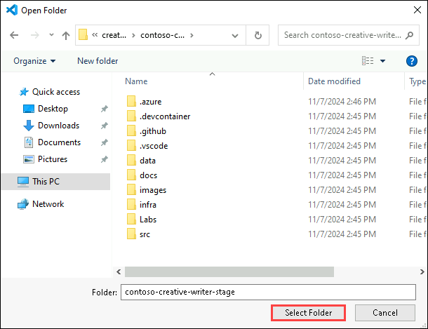
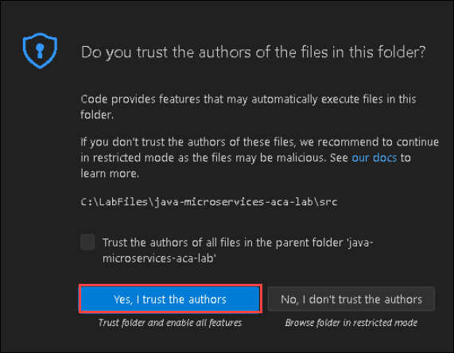
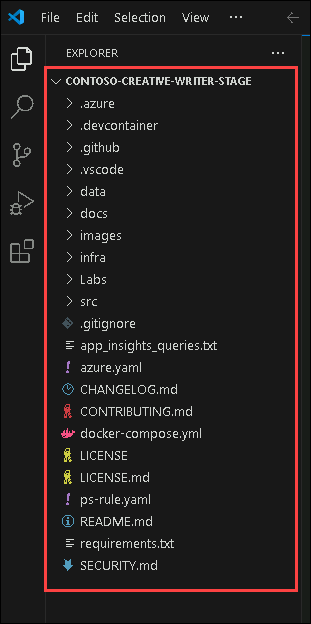
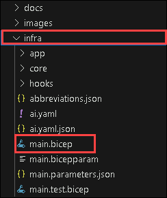

# Exercise 1: Deploying Resources with Azure Developer CLI

### Estimated Duration: 1 Hour

## Lab Scenario

In this exercise, you will deploy the necessary resources for your FastAPI application using the Azure Developer CLI (azd). You will set up your environment, initialize and configure the deployment process, and use azd commands to provision and deploy services in Azure. 

## Lab Objectives

After you complete this exercise, you will:

- Understanding Azure Developer CLI and the Deployment Workflow.
- Streamlining Azure Resource Deployment with Azure Developer CLI (azd)

### Task 1: Understanding Azure Developer CLI and the Deployment Workflow

In this task, you will gain an understanding of the Azure Developer CLI (azd) and how it facilitates the deployment of cloud resources. You'll explore the main.bicep file, the core infrastructure template for your application, and learn about the primary resources it defines, including key parameters, dependencies, and outputs. By the end, you'll be familiar with how azd uses this file to automate provisioning, setting the foundation for deploying resources with ease in the next steps.

>**Labtip:** **AZD (Azure Developer CLI)** is a command-line tool designed to streamline the process of building, deploying, and managing Azure applications. It simplifies the interaction with Azure resources by allowing developers to define infrastructure using code, deploy applications, and manage environments in a more efficient and automated way.

1. From the desktop, open **Visual Studio Code**.

   

1. On **Visual Studio Code** pane, select **Open Folder** under **file** menu from top menu.

   

1. Navigate to `C:\creative-writer\contoso-creative-writer-stage` directory, click on **Select folder**.

   

1. Once you open the folder in Visual Studio Code, on Do you trust the authors of the files of this folder? pop up, click on Yes, I trust the authors.

   

1. Once you have the **contoso-creative-writer-stage** directory opened, ensure you have the source code files from the **explorer pane**

   
   
1. From the explorer menu, navigate to `/infra/main.bicep` file to review. A Bicep file is a simplified, readable syntax for defining and deploying Azure resources, which is compiled into ARM templates for deployment.

   

1. In the `main.bicep`. navigate to **ai** module definition.
 
   ```bicep
    module ai 'core/host/ai-environment.bicep' = {
    name: 'ai'
    scope: resourceGroup
    params: {
        location: location
        tags: tags
        hubName: !empty(aiHubName) ? aiHubName : 'ai-hub-${resourceToken}'
        projectName: !empty(aiProjectName) ? aiProjectName : 'ai-project-${resourceToken}'
        keyVaultName: !empty(keyVaultName) ? keyVaultName : '${abbrs.keyVaultVaults}${resourceToken}'
        storageAccountName: !empty(storageAccountName)
        ? storageAccountName
        : '${abbrs.storageStorageAccounts}${resourceToken}'
        openAiName: !empty(openAiName) ? openAiName : 'aoai-${resourceToken}'
        openAiConnectionName: !empty(openAiConnectionName) ? openAiConnectionName : 'aoai-connection'
        openAiContentSafetyConnectionName: !empty(openAiContentSafetyConnectionName) ? openAiContentSafetyConnectionName : 'aoai-content-safety-connection'
        openAiModelDeployments: array(contains(aiConfig, 'deployments') ? aiConfig.deployments : [])
        logAnalyticsName: !useApplicationInsights
        ? ''
        : !empty(logAnalyticsWorkspaceName)
            ? logAnalyticsWorkspaceName
            : '${abbrs.operationalInsightsWorkspaces}${resourceToken}'
        applicationInsightsName: !useApplicationInsights
        ? ''
        : !empty(applicationInsightsName) ? applicationInsightsName : '${abbrs.insightsComponents}${resourceToken}'
        containerRegistryName: !useContainerRegistry
        ? ''
        : !empty(containerRegistryName) ? containerRegistryName : '${abbrs.containerRegistryRegistries}${resourceToken}'
        searchServiceName: !useSearch ? '' : !empty(searchServiceName) ? searchServiceName : '${abbrs.searchSearchServices}${resourceToken}'
        searchConnectionName: !useSearch ? '' : !empty(searchConnectionName) ? searchConnectionName : 'search-service-connection'
      }
    }
   ```

   >This module sets up essential AI infrastructure, such as Azure OpenAI, Key Vault, storage accounts, and log analytics.

   >It allows customization via parameters like openAiName, keyVaultName, and storageAccountName.

   >Additionally, it handles the setup for application insights and container registries.

1. The next part defines the configuration for deploying a Bing Search resource in Azure. It is set to be deployed globally and provides the search functionality for the application.

   ```bicep
   module bing 'core/bing/bing-search.bicep' = {
   name: 'bing'
   scope: resourceGroup
   params: {
      name: 'agent-bing-search'
      location: 'global'
      }
    }
   ```

   >This module configures a Bing Search resource in the global region, which will be used for search-related operations.

   >The name and location parameters can be customized to define the Bing service's characteristics.

### Task 2: Streamlining Azure Resource Deployment with Azure Developer CLI (azd)

In this task, you will be using the Azure Developer CLI (azd) to deploy the resources defined in your Bicep templates to Azure. The Azure Developer CLI simplifies the process of managing infrastructure as code, allowing you to efficiently deploy, manage, and monitor your applications and resources directly from the command line.

1. As you are on **Visual Studio Code** pane, open **New terminal** from **Terminal** menu using the top menu bar.

   

1. Once the terminal is open, select **v (1)** from the right corner and select **Git Bash (2)** from the menu.

   

   >**LabTip: Git Bash** is a command-line tool for Windows that lets users run Git commands and Unix-like shell commands.

1. Once the **GitBash** terminal opened, run the following command to Sign in and authenticate the azd tool.

   ```bash
   azd auth login
   ```
1. Once you run this command, a sign in page opens up, as you have already logged in to portal you just need to select your account and click continue.

1. Once you logged in successfully, navigate back to your **GitBash** terminal and run the following command to authenticate **Azure CLI** tool aswell.

   ```bash
   az login
   ```
   >Note: You may need to minimize Visual Studio Code pane to see the pop up window to sign in.

1. Once you are on the pop up window, select **Work or school account** and click on **Continue**.

   

1. In the sign in page, provide the following:

   Username: <inject key="AzureAdUserEmail"></inject> and click on **Next**.

   

   Password: <inject key="AzureAdUserPassword"></inject> and click on **Sign in**.

   

1. When prompts, click on **No, sign in to this app only** and continue.

1. Return to your **Visual Studio Code** terminal, now it prompts you to select subscription with a list of subscriptions, enter **1** and hit enter.

1. Once you have successfully logged in, run the following command which will deploy all the defined resources in Azure.

   ```
   azd up
   ```

1. Once you run this command it will prompt to select subscription, just hit enter and continue.

   

1. In the next prompt, it will ask to select location. Use the arrow keys and select **Canada East** region from the list.

   

1. In the next prompt, it will ask to select resource group. Use the arrow keys and select **rg-creative** resource group from the list.

   

   >This may take upto 15 minutes to deploy all the rsources, till then please move to next exercise as that is a read-only exercise where you will get to know the core application and technology stacks used.
   
   > If you encounter an error like **error executing step command** please ignore it and proceed to the next exercise.

   <validation step="45d3bb64-1c15-4974-9ead-629db5887289" />
   
   > **Congratulations** on completing the task! Now, it's time to validate it. Here are the steps
   > - Hit the Validate button for the corresponding task. If you receive a success message, you can proceed to the next task. 
   > - If not, carefully read the error message and retry the step, following the instructions in the lab guide.
   > - If you need any assistance, please contact us at cloudlabs-support@spektrasystems.com. We are available 24/7 to help you out.

## Summary

In this exercise, you have learned how to use the Azure Developer CLI (AZD) to deploy resources for your application. You explored how to define and configure infrastructure using a Bicep file, initialized tracing for monitoring, and successfully deployed resources such as container apps and AI environments using AZD.

### you have successfully completed this exercise!!


