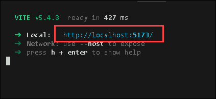
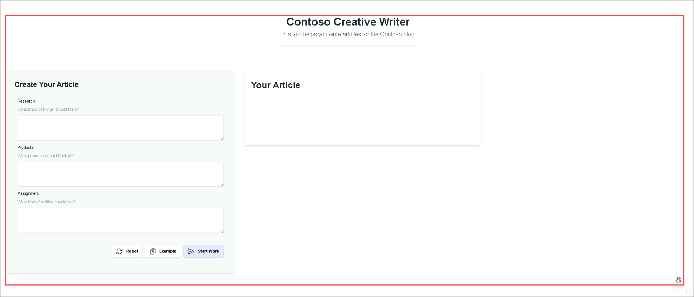
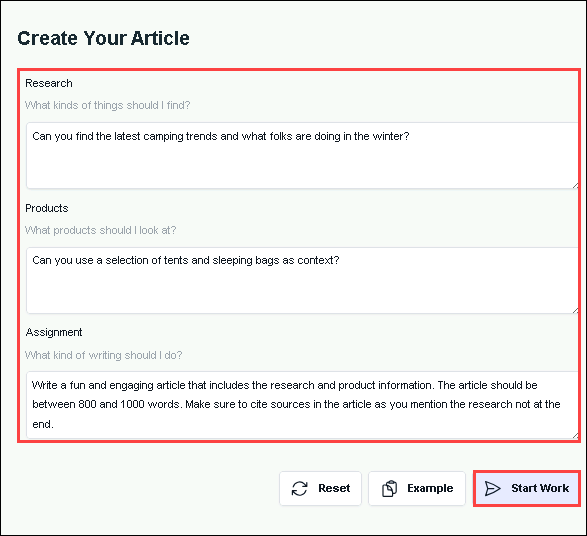
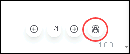
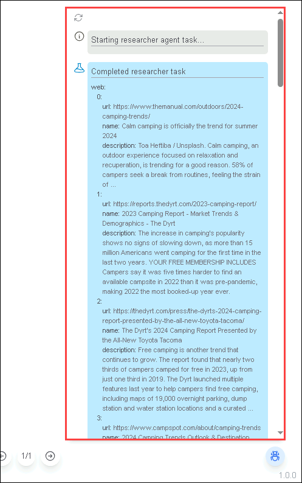

# Exercise3: Testing the Application: API and Web Components

### Estimated Duration: 30 minutes

## Lab Scenario

In this exercise, you will validate the functionality of the application by running both the API and Web components. You will ensure that each part operates correctly and can seamlessly communicate with one another, confirming that the entire application is functioning as expected by genrating the articles from the application.

## Lab Objectives

After you complete this exercise, you will:

 -  Learn to run and verify both Python and Javascript components of the application.

### Task1: Testing the Application Locally: API and Web

In this task, you will learn how to test the application locally by running both the API and Web parts on your local machine. You will set up the necessary environment, run the components, and verify their functionality.

1. As the **Visual Studio Code** is already open, navigate back to your **Git Bash** terminal and navigate to `/src/api` from the explorer menu. 

   ```bash
   cd src/api
   ```

1. Now as you are inside `api` directory, run the following command to start your **API** component.

   ```bash
   fastapi dev main.py
   ```

1. Once you run this command, the **API (Backend)** will be running on your local system. Please make sure you dont close the terminal or stop the process.

1. Now to run the **WEB (Frontend)** you have to open a new tab on terminal.

1. From the top right corner, click on **v (1)** and select **Git Bash (2)** to open a new tab of Git Bash terminal.

   

1. Once you are in the new tab in **Git Bash** terminal, navigate to `/src/web` directory.

   ```bash
   cd src/web
   ```

1. Now that you have navigated to `web` directory, run the following command first to install all the dependencies and setup the environment.

   ```bash
   npm install
   ```

1. Once you have installed all the dependencies and the environment is set up, run the following command to start the frontend service.

   ```bash
   npm run dev
   ```
   
   >By running this command, the frontend will be started on your local system. Make sure you don't close the terminal tab.

1. Now you will see the URL for the application which is running locally. To access that hover over the link and do **CTRL+Click**, it will directly navigate to the application interface.

   

1. Once you navigate to your application, you'll be seeing a interface similar to this.

   

1. On the application pane, click on **Example** to genrate a example prompt for the article generation. 

   

1. Now as the propmpt is ready, click on **Start Work** to generate the article.

   

   >It will take sometime to generate the article, please wait till it generate.

   

1. Now as the article is generated, you can click on **Debug** symbol from the bottom right corner to check how the process are going on in the backend.

   

   >This will open up a new tab from right in which you will be able to trace allthe processes happening in backend.

   

1. Now you can try modifiying the example prompt and change the topic and instruction to play with the application.

## Summary

In this exercise, you have tested the application by running both the API and Web components. You verified that each component is functioning properly and that they can communicate with each other seamlessly, ensuring the application operates as expected. This process helped ensure that the entire system is ready for further deployment or development stages.

### you have successfully completed this exercise!!