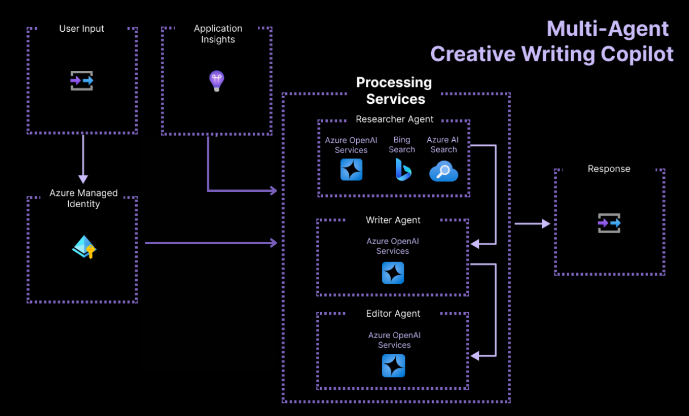
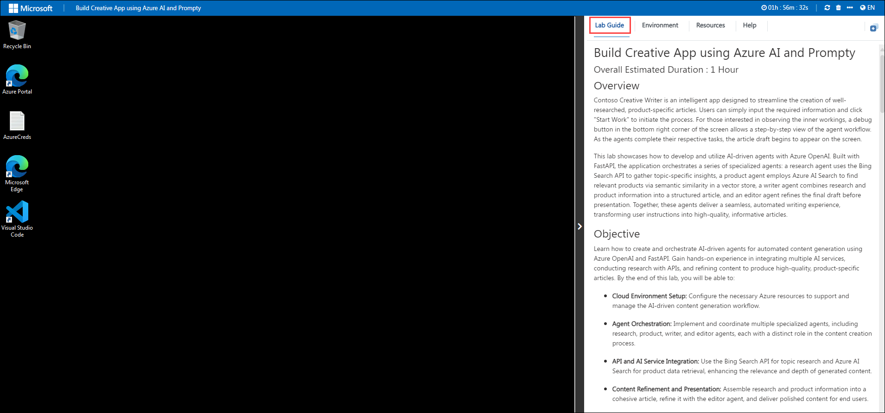
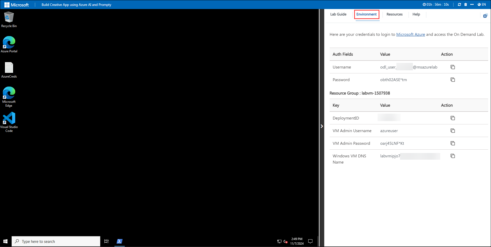

# Build Creative App using Azure AI and Prompty

### Overall Estimated Duration: 2 Hours

## Overview

Creative Writer is an intelligent app designed to streamline the creation of well-researched, product-specific articles. Users can simply input the required information and click on "Start Work" to initiate the process. For those interested in observing the inner workings, a debug button in the bottom right corner of the screen allows a step-by-step view of the agent workflow. As the agents complete their respective tasks, the article draft begins to appear on the screen.

This lab showcases how to develop and utilize AI-driven agents with Azure OpenAI. Built with FastAPI, the application orchestrates a series of specialized agents: a research agent uses the Bing Search API to gather topic-specific insights, a product agent employs Azure AI Search to find relevant products via semantic similarity in a vector store, a writer agent combines research and product information into a structured article, and an editor agent refines the final draft before presentation. Together, these agents deliver a seamless, automated writing experience, transforming user instructions into high-quality, informative articles.

## Objective

Learn how to create and orchestrate AI-driven agents for automated content generation using Azure OpenAI and FastAPI. Gain hands-on experience in integrating multiple AI services, conducting research with APIs, and refining content to produce high-quality, product-specific articles. By the end of this lab, you will be able to:

- **Deploy Resources with Azure Developer CLI:** Learn to efficiently deploy and manage Azure resources using the Azure Developer CLI, streamlining your development and deployment workflows.

- **Explore the Building Blocks of the Application:** Understand the backend and how the application is built.

- **Test the Application: API and Web Components:** Learn to run the application locally and test all the functionalities of that application.

- **Debug and Evaluate Application Logic:** Learn to run the orchestrator, activate tracing for debugging purposes, and assess the generated content's quality.

## Prerequisites

- **Familiarity with Azure:** Basic knowledge of Azure services and the Azure Portal for managing cloud resources.

- **Basic Knowledge of Python:** Familiarity with Python programming to work with the FastAPI framework and understand the agent workflows.

- **Understanding of Azure Developer CLI:** Basic understanding of how to deploy resources using Azure Developer CLI.

## Architecture

The architecture includes a series of AI-driven agents working together to produce high-quality, product-specific articles. User input flows through Azure Container Apps (ACA) with the security of Azure Managed Identity. The Researcher Agent uses Azure OpenAI, Bing Search, and Azure AI Search to gather relevant information, while the Writer Agent structures this content into an article, and the Editor Agent refines it for clarity and quality. Application Insights monitors the system's performance, ensuring a seamless experience for users as they receive their final, polished content.

## Architecture Diagram

## Explanation of Components

1. **Azure OpenAI:** Provides advanced natural language understanding and generation capabilities, enabling the agent to interpret user input and generate meaningful results. This will be used for advanced natural language processing capabilities, enabling the agent to understand and process the user’s input.

2. **Bing Search API:** Allows the agent to access up-to-date information from the web by conducting real-time searches, helping gather relevant content. This will be used to search regarding the topic provided in the user input.

3. **Azure AI Search:** A search service that performs semantic searches within a vector store, enabling the agent to find relevant data by understanding the meaning behind queries. This will be used to find the main keywords in the prompt given by the user.

4. **Application Insights:** Part of Azure Monitor, this service tracks the performance and health of the application, logging metrics and providing alerts. It enables monitoring for optimization and helps ensure the reliability of the overall system.

5. **Azure Managed Identity:** Provides an automatically managed identity for your Azure resources to securely authenticate to services without the need for explicit credentials. It simplifies secure access to Azure services. This will be used to resolve access for the backend services from the application hosted.

6. **Visual Studio Code (VS Code):** A lightweight, open-source code editor developed by Microsoft, supporting a wide range of programming languages and extensions. This will be used for the development and deployment of the application in this lab.

## Getting Started with Lab

Welcome to your Build Creative App using Azure AI and Prompty Lab! We've prepared a seamless environment for you to explore and learn. Let's begin by making the most of this experience.

### Accessing Your Lab Environment

Once you are ready to dive in, your **virtual machine** and **lab guide** will be right at your fingertips within your web browser.

### Exploring Your Lab Resources

To get a better understanding of your lab resources and credentials, navigate to the **Environment** tab.

### Utilizing the Split Window Feature

For convenience, you can open the lab guide in a separate window by selecting the **Split Window** button from the top right corner.

### Managing your Virtual Machine

Feel free to start, stop, or restart your virtual machine as needed from the **Resources** tab. Your experience is in your hands!

## Let's Get Started with the Azure Portal

1. In the **JumpVM**, click on the **Azure portal** shortcut of the Microsoft Edge browser, which is created onthe desktop.

   

   >If a PowerShell window openes up, please minimize it and continue with the lab. Make sure you do not close that window.

2. On the **Sign in to continue to Microsoft Azure** tab, you will see a login screen. In that, enter the following email/username and then click on **Next**.

   - Email/Username: <inject key="AzureAdUserEmail"></inject>
     
     

3. Now, enter the following password and click on **Sign in**.

   - Password: <inject key="AzureAdUserPassword"></inject>

     

     >**Note:** If you see the **Action Required** dialog box, then select the **Ask later** option.

     

4. If you see the pop-up "**Stay signed in**." Click on **No**.

5. If you see the pop-up "**You have free Azure Advisor recommendations!**" Close the window to continue with the lab.

6. If a **Welcome to Microsoft Azure** pop-up window appears, click on **Cancel** to skip the tour.

7. Now, click on **Next** from the lower right corner to move on to the next page.

## Support Contact

1. The CloudLabs support team is available 24/7, 365 days a year, via email and live chat to ensure seamless assistance at any time. We offer dedicated support channels tailored specifically for both learners and instructors, ensuring that all your needs are promptly and efficiently addressed. Learner support contacts:

   - **Email Support**: cloudlabs-support@spektrasystems.com
   - **Live Chat Support**: https://cloudlabs.ai/labs-support

2. Now, click on **Next** from the lower right corner to move on to the next page.

## Happy Learning!!

